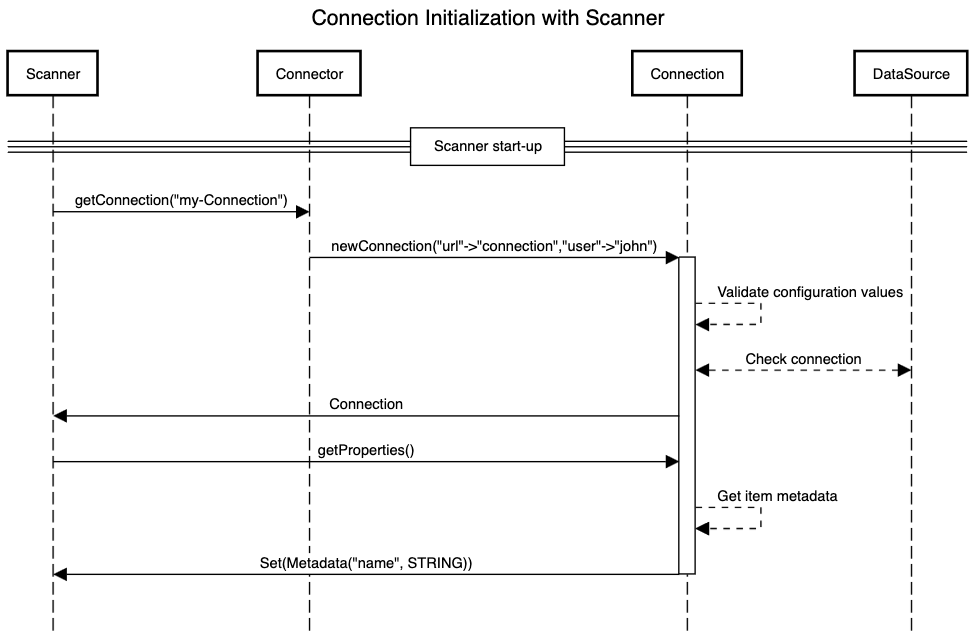
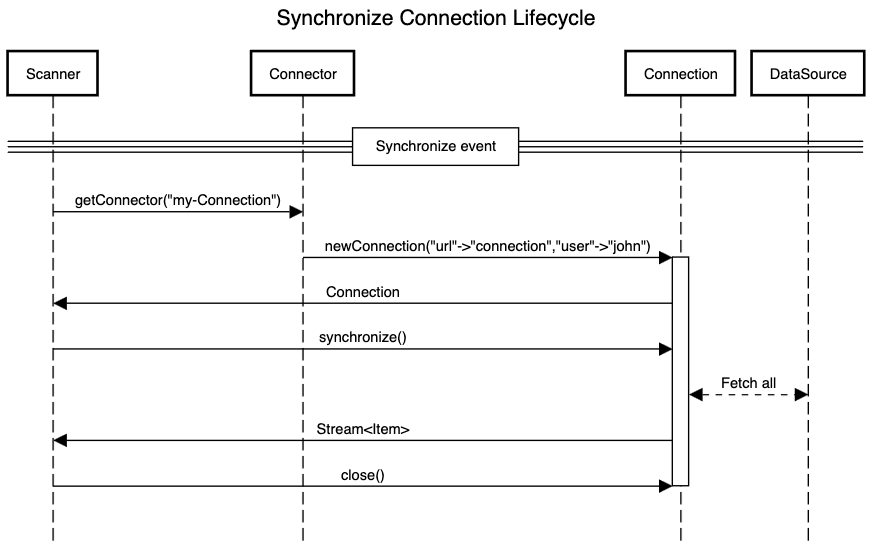
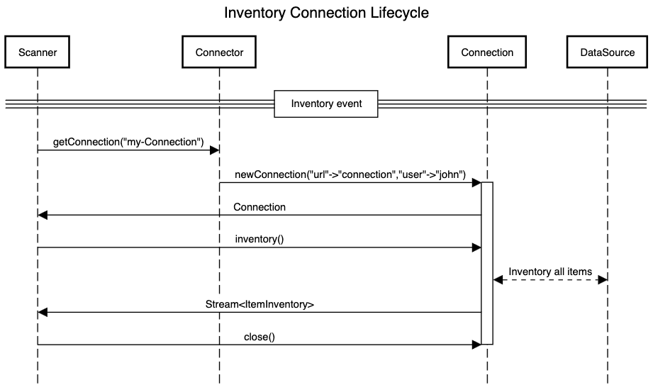
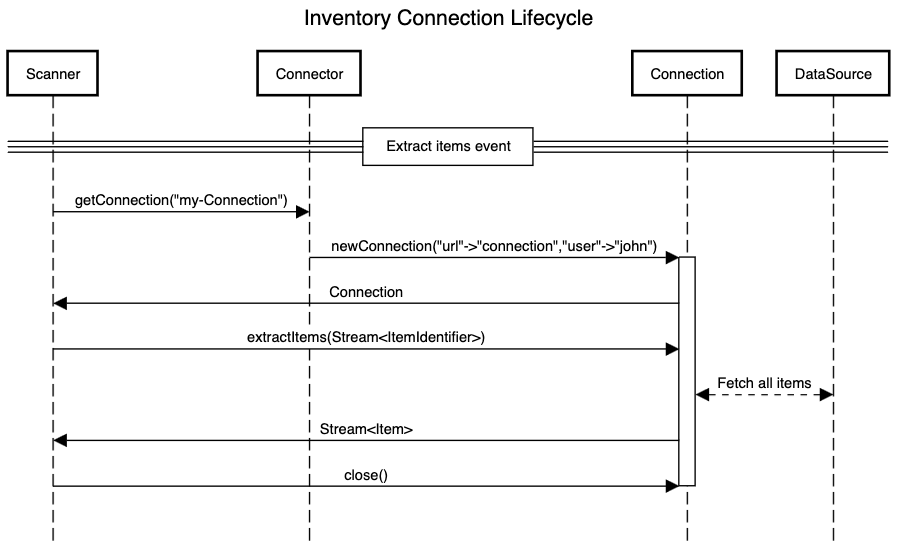

# public-connector-sdk

This project allows the development of a Connector that can be loaded into Zeenea Scanner for use with Zeenea
Datacatalog.

## Overview

This project mainly consists in various interfaces that a Connector must comply to in order to be properly loaded and
operable from Zeenea Scanner.

## Getting started

### `Plugin`

Connector loading and classpath isolation are powered by [pf4j](https://pf4j.org/).
A manifest file called *plugin.properties* must be created.

```
plugin.id=example-plugin
plugin.provider=Example
plugin.version=1.0.0
``` 

More information on the subject can be found on [pf4j's website](https://pf4j.org/doc/getting-started.html).

### `Connector`

Next in line is the implementation of `Connector`, which is a factory used to identify and create instances of the
Connection instances.

```java
package com.example.connector;

import zeenea.connector.Connection;
import zeenea.connector.ConnectionConfiguration;
import zeenea.connector.Connector;
import zeenea.connector.exception.InvalidConfigurationException;

@Extension
public class ExampleConnector implements Connector {
    public String getConnectorId() {
        // Used to select the connector
        return "example";
    }

    public Connection newConnection(ConnectionConfiguration connectionConfiguration) throws InvalidConfigurationException {
        // Configuration validation might be performed here
        // Invalid configuration is best conveyed by throwing an InvalidConfigurationException
        return connector;
    }
}
```

### `Connection`

The main piece here is of course the `Connection` itself.

```java
package com.example.connector;

import org.slf4j.Logger;
import org.slf4j.LoggerFactory;
import zeenea.connector.Connection;
import zeenea.connector.contact.Contact;
import zeenea.connector.property.PropertyDefinition;
import zeenea.connector.property.StringPropertyDefinition;
import zeenea.connector.Item;
import zeenea.connector.visualization.Visualization;
import zeenea.connector.field.Field;
import zeenea.connector.common.ItemIdentifier;
import zeenea.connector.common.IdentificationProperty;
import zeenea.connector.common.ItemReference;

import java.time.Instant;
import java.util.*;
import java.util.stream.Stream;

public class ExampleConnection implements Connection {
    // slf4j might be used for logging
    private static final Logger LOGGER = LoggerFactory.getLogger(ExampleConnection.class);

    private static final StringPropertyDefinition TYPE_METADATA = new StringPropertyDefinition("Type");

    public Set<PropertyDefinition> getProperties() {
        // Value returned here can be dynamic and change over successive calls
        return new HashSet<>(Collections.singletonList(TYPE_METADATA));
    }

    @Override
    public Stream<Item> synchronize() {
        return Stream.of(
                Visualization.builder()
                        .id(
                                ItemIdentifier.of(
                                        IdentificationProperty.of("type", "visualization"),
                                        IdentificationProperty.of("report_id", "1234"),
                                        IdentificationProperty.of("workspace_id", "4321")))
                        .name("Visualization name")
                        .description("Some description")
                        .properties(PropertiesBuilder.create().put(TYPE_METADATA, "some type").build())
                        .fields(
                                List.of(
                                        Field.builder()
                                                .name("dim1")
                                                .dataType(DataType.String)
                                                .nativeType("string")
                                                .description("some field description")
                                                .itemReferences(List.of())
                                                .keys(List.of("dim1"))
                                                .build(),
                                        Field.builder()
                                                .name("mes1")
                                                .dataType(DataType.String)
                                                .nativeType("string")
                                                .description("some field description")
                                                .itemReferences(List.of())
                                                .keys(List.of("mes1"))
                                                .build()))
                        .sourceDatasets(
                                List.of(
                                        ItemReference.of(
                                                ItemIdentifier.of(IdentificationProperty.of("id", "dataset2")),
                                                ConnectionReferenceCode.of("reference"))))
                        .contactRelations(
                                List.of(Contact.of("test@zeenea.com", "Some name", "0600000000", "Owner")))
                        .build());
    }

    public void close() {
        // Resources previously opened can be closed here
    }
}
```

### Installation

Build and package as a zip archive as follows:

```
plugin.properties (plugin metadata)
classes/
├── (project classes)
├── META-INF/
    ├── extensions.idx (list of connector factories)
lib/
├── (jar dependencies)
```

Copy the zip archive into the *plugins* folder of the Scanner, then restart the Scanner.

The Connector Id should be visible in Scanner logs.

### Local publication

In order to reference this package locally from other repositories (like [scanner][scanner]), one can run:

```shell
./gradelw publishToMavenLocal
```

## How it works

### Lifecycle

On Zeenea Scanner startup, instances of `Connector` discovered in the *plugins* folder are created.

Their configuration is then immediately validated by creating an instance of `Connection` for every factory, followed by
successive calls to `connection.getProperties()` and `connection.close()`. `Connection` instances are then discarded.

`PropertyDefinition` collected this way are then submitted to Zeenea Datacatalog and made accessible to operators in the
Admin interface.

### On scanner start-up

The following diagram exposes the initialization sequence of connectors in the Scanner.


### Synchronization

A click on the **Synchronize** button in Zeenea Datacatalog's Admin interface triggers the creation of a
new `Connection`
from the factory and the retrieval, through the Connection, of items located in the datasource.

The following diagram exposes the chaining of method calls leading to the actual sync.



After a successful synchronization, items should be visible in Zeenea Datacatalog's Studio interface.

### Inventory

A click on the **Inventory** button in Zeenea Datacatalog's Admin interface triggers the creation of a new `Connection`
from the factory and the retrieval, through the Connection, of identifiers of existing items located in the datasource.

The following diagram exposes the chaining of method calls leading to the item inventory.



After a successful inventory, items should be importable in Zeenea Datacatalog's Studio interface.

### Extract items

A click on the **Item import** button in Zeenea Datacatalog's Studio interface triggers the creation of a
new `Connection` from the factory and the retrieval, through the Connection, of specified items located in the
datasource.

The following diagram exposes the chaining of method calls leading to the extract item.



After a successful extract item, items should be visible in Zeenea Datacatalog's Studio interface.

[scanner]: https://github.com/zeenea/scanner
