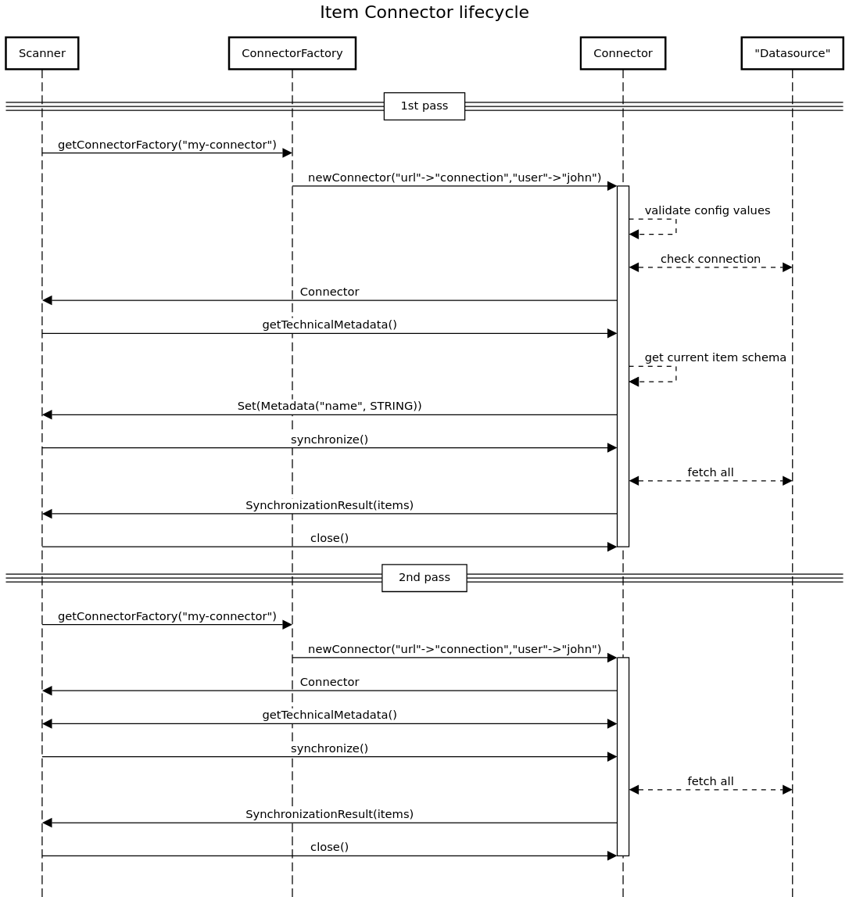

# public-connector-sdk

This project allows the development of a Connector that can be loaded into Zeenea Scanner for use with Zeenea Datacatalog. 

## Overview

This project mainly consists in various interfaces that a Connector must comply to in order to be properly loaded and operable from Zeenea Scanner.

## Getting started

### `Plugin`

Connector loading and classpath isolation are powered by [pf4j](https://pf4j.org/).

A requirement for proper discoverability is to create an implementation of `org.pf4j.Plugin`.

Implementing a `Plugin` brings the additional advantage of providing hooks to the _plugin_ lifecycle (loading, unloading).

```java
package com.acme.connector;

import org.pf4j.Plugin;
import org.pf4j.PluginWrapper;

public class AcmeConnectorPlugin extends Plugin {
   public AcmeConnectorPlugin(PluginWrapper wrapper) {
       super(wrapper);
   }
}
```

Additionally, a manifest file called *plugin.properties* must be created.

```
plugin.class=com.acme.connector.AcmeConnectorPlugin
plugin.id=acme-plugin
plugin.provider=Acme
plugin.version=0.0.1
``` 

More information on the subject can be found on [pf4j's website](https://pf4j.org/doc/getting-started.html).

### `ConnectorFactory`

Next in line is the implementation of `ConnectorFactory`, which is used to identify and create instances of the Connector.

```java
package com.acme.connector;

import zeenea.sdk.Connector;
import zeenea.sdk.ConnectorConfiguration;
import zeenea.sdk.ConnectorFactory;
import zeenea.sdk.InvalidConfigurationException;

public class AcmeConnectorFactory implements ConnectorFactory {
    public String getConnectorId() {
        // Used to select the connector
        return "acme";
    }
    public Connector newConnector(ConnectorConfiguration connectorConfiguration) throws InvalidConfigurationException {
        // Configuration validation might be performed here
        // Invalid configuration is best conveyed by throwing an InvalidConfigurationException
        return connector;
    }
}
```

In order to be discoverable by the Scanner, the Fully Qualified Name of this class must be added to file *META-INF/extensions.idx*.

```
com.acme.connector.AcmeConnectorFactory
```

### `Connector`

The main piece here is of course the `Connector` itself.

```java
package com.acme.connector;

import org.slf4j.Logger;
import org.slf4j.LoggerFactory;
import zeenea.sdk.Connector;
import zeenea.sdk.businessterm.SourceBusinessTerm;
import zeenea.sdk.contact.SourceContactRelation;
import zeenea.sdk.metadata.Metadata;
import zeenea.sdk.metadata.StringMetadata;
import zeenea.sdk.synchronization.SourceItemAction;
import zeenea.sdk.synchronization.SynchronizationResult;

import java.time.Instant;
import java.util.*;
import java.util.stream.Stream;

public class AcmeConnector implements Connector {
    // slf4j might be used for logging
    private static final Logger LOGGER = LoggerFactory.getLogger(AcmeConnector.class);

    private static final StringMetadata TYPE_METADATA = new StringMetadata("Type");

    public Set<Metadata> getTechnicalMetadata() {
        // Value returned here can be dynamic and change over successive calls
        return new HashSet<>(Collections.singletonList(TYPE_METADATA));
    }
    
    public SynchronizationResult synchronize() {
        // Return a SynchronizationResult containing a Stream to item actions
        // Item actions can be upsert or delete
        // This is where items would commonly be fetched from the datasource
        // Stream is closed by Scanner upon completion
        return new SynchronizationResult(Stream.of(
                // Upsert
                SourceItemAction.upsert(SourceBusinessTerm.builder()
                        .id("updated-item-id")
                        .name("updated-item")
                        .addMetadata(TYPE_METADATA, "technical-item")
                        .updateTime(Instant.now())
                        .addContactRelation(SourceContactRelation.builder()
                                .email("owner@acme.com")
                                .role("owner")
                                .build())
                        .build()),
                // Delete
                SourceItemAction.delete("deleted-item-id")));
    }
    
    public void close() {
        // Resources previously opened can be closed here
    }
}
```

### Installation

Build and package as a zip archive as follows:

```
plugin.properties (plugin metadata)
classes/
├── (project classes)
├── META-INF/
    ├── extensions.idx (list of connector factories)
lib/
├── (jar dependencies)
```

Copy the zip archive into the *plugins* folder of the Scanner, then restart the Scanner.

The Connector Id should be visible in Scanner logs.

## How it works

### Lifecycle

On Zeenea Scanner startup, instances of `ConnectorFactory` discovered in the *plugins* folder are created.

Their configuration is then immediately validated by creating an instance of `Connector` for every factory, followed by successive calls to `connector.getMetadata()` and `connector.close()`. `Connector` instances are then discarded.

`Metadata` collected this way are then submitted to Zeenea Datacatalog and made accessible to operators in the Admin interface.

### Synchronization

A click on the **Synchronize** button in Zeenea Datacatalog's Admin interface triggers the creation of a new `Connector` from the factory and the retrieval, through the Connector, of items located in the datasource.

The following diagram exposes the chaining of method calls leading to the actual sync.



After a successful synchronization, items should be visible in Zeenea Datacatalog's Studio interface.

## Side notes

* A `Plugin` may contain multiple different `ConnectorFactory` implementations. It is thus possible to create a single plugin to handle more than one Connector, just be sure to add all appropriate FQNs to file `META-INF/extensions.idx`.
